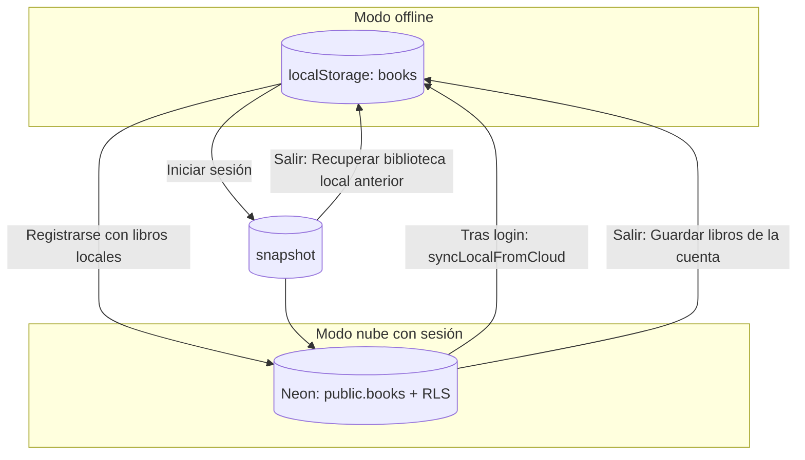

# Sincronización offline ↔ nube

Este documento describe cómo la app gestiona la biblioteca de libros al pasar entre **modo offline** y **modo nube** (Neon Auth + Neon Data API), incluidos los diálogos de confirmación y qué ocurre con `localStorage`.

## Dos modos de funcionamiento

| Modo | Selector UI | Dónde se guardan los libros | Requiere sesión |
| --- | --- | --- | --- |
| **Offline** | `Offline` | `localStorage` (`books`) | No |
| **Nube** | `Nube` | Neon Postgres vía Data API | Sí (login o registro) |

El selector **Offline / Nube** solo aparece si están configuradas `VITE_NEON_AUTH_URL` y `VITE_NEON_DATA_API_URL`. Sin esas variables, la app funciona únicamente en modo offline.

En modo nube, la UI usa el repositorio de Neon mientras hay sesión. En offline, siempre usa el repositorio local. La misma interfaz (`BooksRepository`) oculta el origen de los datos.

## Claves en `localStorage`

| Clave | Contenido |
| --- | --- |
| `books` | Biblioteca local activa (modo offline y copia de respaldo en el dispositivo) |
| `books-pre-cloud-snapshot` | Copia de `books` **justo antes** de iniciar sesión o registrarse en la nube |
| `app-mode` | Preferencia del usuario: `"offline"` o `"cloud"` |

El **snapshot** permite recuperar la biblioteca local que existía antes de conectarse a la nube, sobre todo al cerrar sesión.

## Vista general del flujo

## Cambiar de modo (sin autenticación)

Al pulsar **Offline** o **Nube** en la cabecera:

- Solo se cambia la fuente de datos en pantalla y se guarda la preferencia en `app-mode`.
- **No** se muestra ningún diálogo de sincronización.
- Si pasas a **Nube** sin haber iniciado sesión, verás el panel de login/registro; los libros en pantalla no se cargan hasta autenticarte.
- Si pasas a **Offline** estando con sesión en nube, sigues viendo la biblioteca de la cuenta hasta que cierres sesión o cambies de nuevo; el almacenamiento local (`books`) no se actualiza solo por cambiar el toggle.

## Iniciar sesión (modo nube)

### Sin libros locales

1. El usuario envía email y contraseña.
2. **No** hay diálogo de confirmación.
3. Se guarda un snapshot del estado local actual (puede ser una lista vacía).
4. Tras login correcto, se descargan los libros de la cuenta y se **sobrescribe** `books` en local (`syncLocalFromCloud`).
5. En pantalla se muestran los libros de la cuenta (Neon).

### Con libros locales

1. Al enviar el formulario, aparece el diálogo **«Sustituir biblioteca local»**:
   - *«Tienes N libros guardados en local. Al iniciar sesión, tu biblioteca local se sustituirá por los libros de tu cuenta. Podrás recuperar la biblioteca local anterior al cerrar sesión.»*
2. **Cancelar** → no se inicia sesión; los libros locales no cambian.
3. **Iniciar sesión** →
   - Snapshot de `books` → `books-pre-cloud-snapshot`
   - Autenticación con Neon Auth
   - Descarga de la biblioteca de la cuenta → sobrescritura de `books`
   - Visualización de los libros de la cuenta

**Importante:** los libros que tenías solo en local **no se suben** al iniciar sesión; se sustituyen por los de la cuenta. El snapshot conserva la copia anterior por si al cerrar sesión eliges recuperarla.

## Registrarse (modo nube)

### Sin libros locales

1. Registro directo, **sin diálogo**.
2. Se guarda snapshot (normalmente vacío).
3. La cuenta nueva empieza sin libros en Neon.
4. En pantalla: biblioteca vacía en la nube.

### Con libros locales

1. Al enviar el formulario, aparece el diálogo **«Subir biblioteca local»**:
   - *«Tienes N libros guardados en local. Se subirán a tu nueva cuenta al registrarte.»*
2. **Cancelar** → no se crea la cuenta; los libros locales no cambian.
3. **Crear cuenta** →
   - Snapshot de `books` → `books-pre-cloud-snapshot`
   - Creación de cuenta en Neon Auth
   - **Subida** de los libros locales a Neon (`replaceAll` en la tabla `books`)
   - Actualización de `books` en local con los IDs que asigna la nube
   - Visualización de la biblioteca ya sincronizada en la cuenta

## Cerrar sesión (Salir)

Al pulsar **Salir** en modo nube (con sesión activa) siempre se muestra un diálogo con dos opciones y **Cancelar**:

**Título:** *«¿Qué hacer con tus libros locales?»*

**Mensaje:** *«Al cerrar sesión puedes guardar los libros de tu cuenta en este dispositivo o recuperar la biblioteca local que tenías antes de conectarte.»*

| Opción | Qué hace | Resultado en `books` (offline) |
| --- | --- | --- |
| **Guardar libros de la cuenta** | Descarga la biblioteca actual de Neon y la escribe en `books` | Copia de la nube en el dispositivo |
| **Recuperar biblioteca local anterior** | Restaura `books-pre-cloud-snapshot` sobre `books` | Vuelve la biblioteca previa al login/registro |
| **Cancelar** | No cierra sesión | Sin cambios |

Después de elegir una opción (no cancelar), se ejecuta `signOut` y la sesión de Neon Auth termina.

## Resumen de escenarios

| Acción | ¿Diálogo? | Efecto en Neon | Efecto en `books` (local) |
| --- | --- | --- | --- |
| Login, sin libros locales | No | Lee libros de la cuenta | Se reemplaza con libros de la cuenta |
| Login, con libros locales | Sí (sustituir) | Lee libros de la cuenta | Snapshot + reemplazo por cuenta |
| Registro, sin libros locales | No | Cuenta vacía | Snapshot (vacío); local sin cambios útiles |
| Registro, con libros locales | Sí (subir) | Inserta libros locales | Snapshot + sync con IDs de la nube |
| Logout → guardar cuenta | Sí (elección) | Sin cambio | Copia de la nube |
| Logout → recuperar anterior | Sí (elección) | Sin cambio | Restaura snapshot |
| Toggle Offline/Nube | No | Depende de sesión | No sincroniza automáticamente |

## Seguridad en la nube

En Neon, cada fila de `public.books` tiene `owner_id` y políticas RLS: un usuario autenticado solo ve y modifica sus propios libros. Las peticiones a la Data API llevan el JWT de Neon Auth.

En offline no hay RLS: todos los libros del dispositivo son visibles en ese navegador.

## Código relacionado

| Archivo | Responsabilidad |
| --- | --- |
| `src/books/localStorage.ts` | Lectura/escritura de `books` y snapshot |
| `src/books/repository.ts` | Repositorios local y nube |
| `src/auth/AuthPanel.tsx` | Login/registro y diálogos previos a auth |
| `src/App.tsx` | Sync tras login, subida tras registro, diálogo de logout |
| `src/ConfirmDialog.tsx` | Componentes `ConfirmDialog` y `ChoiceDialog` |

## Limitaciones actuales

- La sincronización **no** es bidireccional en tiempo real: offline y nube son fuentes distintas hasta que un flujo de auth o logout las alinea.
- Cambiar el toggle Offline/Nube **no** fusiona bibliotecas; solo cambia qué repositorio usa la UI.
- El snapshot se sobrescribe en cada login o registro exitoso (tras confirmar el diálogo si aplica).
- Si falla la subida o la descarga en un flujo async, el usuario ve un error en pantalla y puede reintentar; el diálogo de logout permanece abierto si falla la operación elegida.
